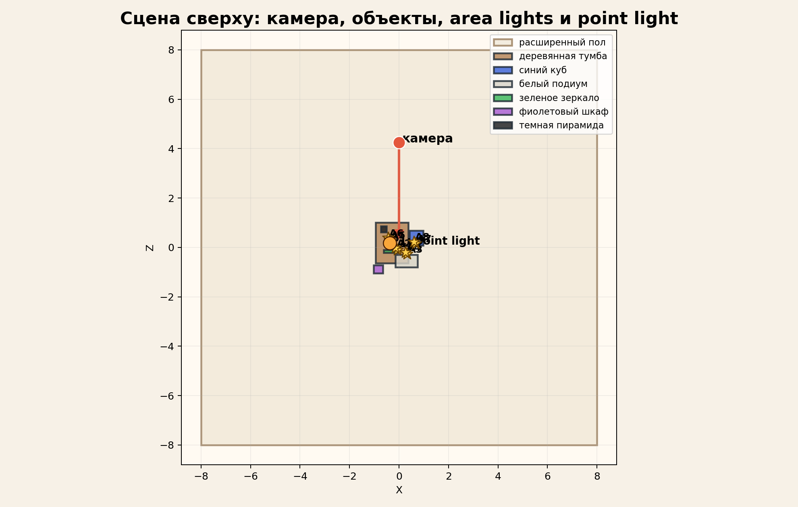
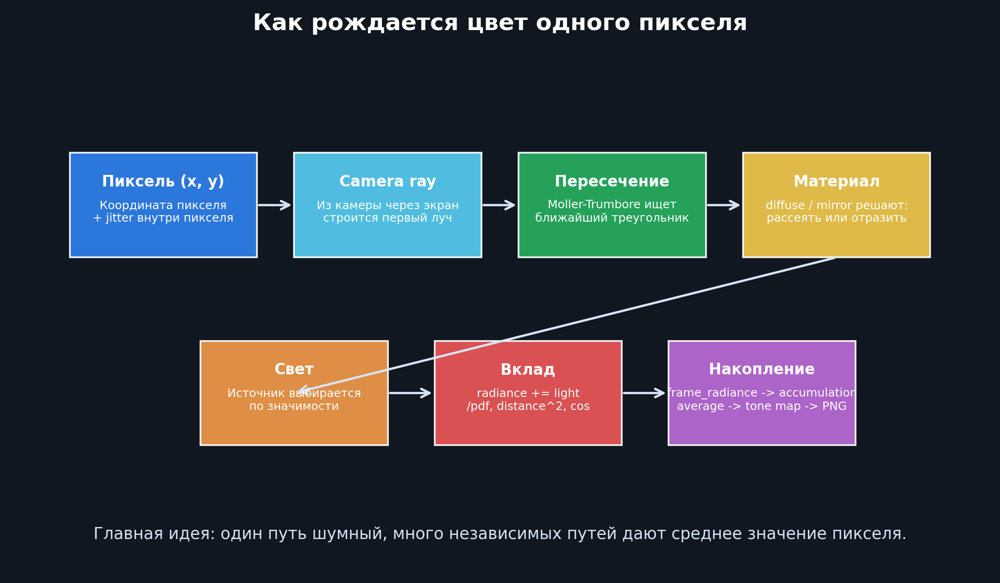
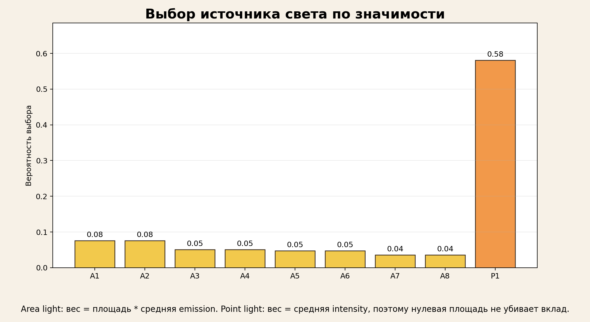
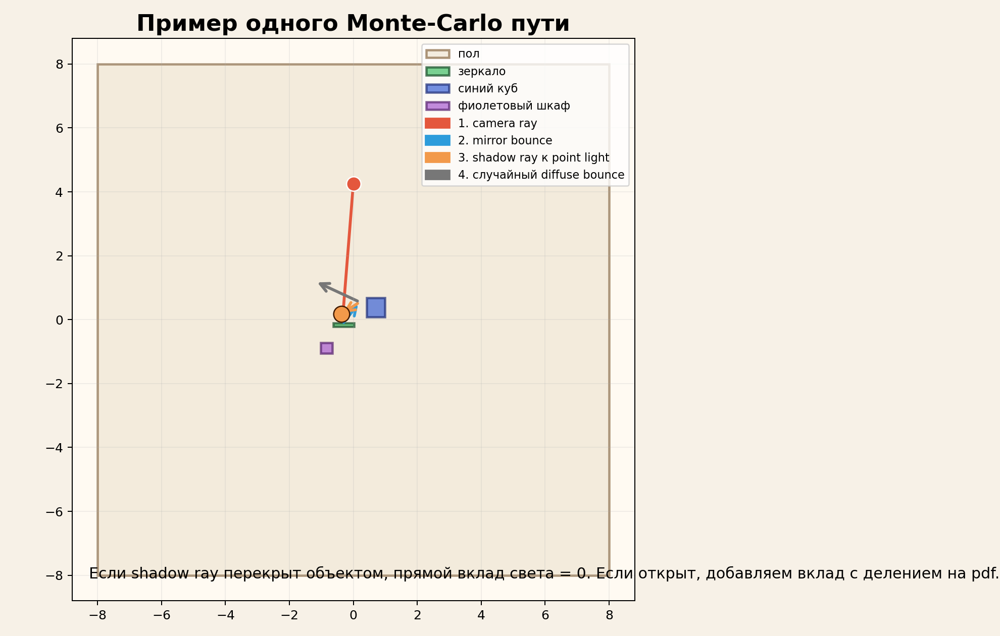
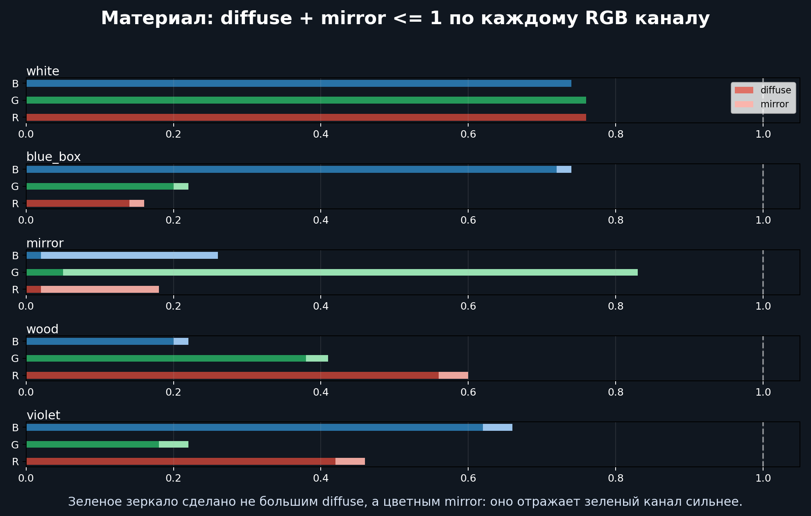
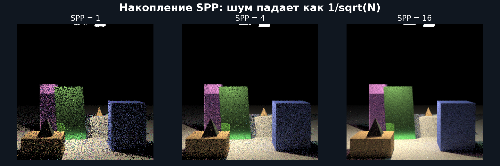

# ЛР 4: визуальная шпаргалка по path tracing

Эта папка нужна не для отчета, а для объяснения человеку, который вообще не шарит в трассировке. Главный файл для показа: `video/lab4_path_tracing_full_explainer.mp4`.

Если нужно быстро посмотреть одним файлом, открывай видео:

```bash
open /Users/rublev/DEV/image/image_processing_methods/labs/lab_04/explain_lab4/video/lab4_path_tracing_full_explainer.mp4
```

Ниже оставлены отдельные картинки как шпаргалка по тем же темам.

## 1. Что находится в сцене



Вся геометрия берется из `examples/default_scene.json`. Там есть камера, треугольники объектов, area lights и один point light.

Главные файлы:

- `examples/default_scene.json` задает сцену, материалы, камеру, источники и настройки рендера.
- `src/image_lab4/io/config_loader.py` читает JSON и превращает его в Python-модели.
- `src/image_lab4/models/scene.py` хранит структуры данных: `Material`, `Triangle`, `PointLight`, `SceneConfig`, `Scene`.

Сцена разбита на треугольники, потому что ray tracing удобнее всего пересекать именно с треугольниками. Даже кубы, зеркало и пирамиды внутри программы становятся набором треугольников.

## 2. Как получается цвет одного пикселя



Для каждого пикселя программа выпускает луч из камеры. Луч летит в сцену и ищет ближайший треугольник. Если попали в поверхность, смотрим материал: он может быть диффузным, зеркальным или смешанным.

Цвет пикселя хранится в двух местах:

- `frame_radiance` хранит один новый случайный кадр, то есть 1 SPP.
- `realtime_accumulation` в GUI хранит сумму всех уже накопленных кадров.
- `current_artifact.radiance` хранит физическую яркость текущего результата, ее можно сохранить в HDR.
- `current_artifact.display` хранит уже tone mapped картинку для PNG/PPM.

В коде это видно в `src/image_lab4/ui/main_window.py`: метод `_render_realtime_frame()` получает новый `frame_radiance`, прибавляет его к `realtime_accumulation`, делит на число кадров и показывает результат.

## 3. Как выбирается источник света



На каждом диффузном попадании мы не перебираем все источники, а выбираем один случайный источник по значимости.

Для area light:

```text
weight = area * emission.average()
```

Для point light:

```text
weight = intensity.average()
```

После выбора вклад делится на вероятность выбора `pdf`. Поэтому маленький, но мощный point light не получает нулевую значимость, хотя у него нет площади.

Где смотреть в коде:

- `src/image_lab4/services/path_tracer.py`, метод `_build_scene()` считает `light_probabilities`.
- `src/image_lab4/services/path_tracer.py`, метод `_sample_direct_lighting()` считает прямой вклад света.
- `src/image_lab4/services/taichi_progressive_path_tracer.py`, kernel `_path_trace_frame_kernel()` делает то же самое на GPU через Taichi/Metal.

## 4. Пример одного Monte Carlo пути



Один путь может выглядеть так:

1. Из камеры выходит луч через пиксель.
2. Луч попадает в зеркало и отражается.
3. В точке попадания запускается shadow ray к выбранному источнику света.
4. Если источник виден, добавляется прямой свет.
5. Потом выбирается следующий отскок: diffuse или mirror.
6. Через несколько отскоков путь заканчивается, а его вклад идет в цвет пикселя.

Один путь почти всегда шумный. Но если таких путей много и они независимые, среднее значение сходится к правильной яркости.

## 5. Как работает цвет материала



Материал хранит два RGB-вектора:

```json
"diffuse": [R, G, B],
"mirror": [R, G, B]
```

`diffuse` отвечает за матовое рассеяние. `mirror` отвечает за зеркальное отражение. Цвет можно задавать и там, и там.

Ограничение:

```text
diffuse[channel] + mirror[channel] <= 1
```

Это закон сохранения энергии в упрощенном виде. Поверхность не должна отражать больше света, чем на нее пришло.

Зеленое зеркало в текущей сцене сделано так:

```json
"diffuse": [0.02, 0.05, 0.02],
"mirror": [0.16, 0.78, 0.24]
```

То есть оно почти не матовое, но зеркальный зеленый канал сильнее красного и синего.

## 6. Почему картинка сначала шумная



SPP означает samples per pixel. Это сколько независимых путей накоплено на один пиксель.

Шум падает примерно так:

```text
noise ~ 1 / sqrt(SPP)
```

Если увеличить SPP в 4 раза, шум станет примерно в 2 раза меньше. Поэтому realtime preview сначала зернистый, но быстро улучшается при накоплении.

В GUI:

- `GPU PathTrace старт` начинает бесконечное progressive-накопление.
- `GPU финал до SPP` догоняет качество до `render.samples_per_pixel` из JSON.
- `Сохранить PNG` сохраняет видимую картинку.
- `Сохранить HDR` сохраняет физическую radiance без потери яркости.

## 7. Что рассказать преподавателю коротко

Мы реализовали Monte Carlo path tracing. Камера выпускает лучи через пиксели, лучи пересекают треугольную сцену, материалы выбирают диффузный или зеркальный отскок, а освещение считается через прямое сэмплирование area и point источников. Источники выбираются по значимости: area lights по площади и emission, point lights по intensity. Каждый кадр дает одну случайную оценку яркости, GUI накапливает их в radiance buffer, потом делает tone mapping для PNG. HDR сохраняет исходные физические яркости.

## 8. Как пересобрать картинки

Без настоящих рендеров, быстро:

```bash
cd /Users/rublev/DEV/image/image_processing_methods/labs/lab_04
source .venv/bin/activate
PYTHONPATH=src python3 explain_lab4/generate_visuals.py
```

С настоящими Taichi/Metal render-картинками для SPP:

```bash
cd /Users/rublev/DEV/image/image_processing_methods/labs/lab_04
source .venv/bin/activate
PYTHONPATH=src python3 explain_lab4/generate_visuals.py --with-renders
```

## 9. Как пересобрать единый ролик

```bash
cd /Users/rublev/DEV/image/image_processing_methods/labs/lab_04
source .venv/bin/activate
PYTHONPATH=src python3 explain_lab4/build_full_explainer_video.py
```

Результат появится здесь:

```text
explain_lab4/video/lab4_path_tracing_full_explainer.mp4
```
